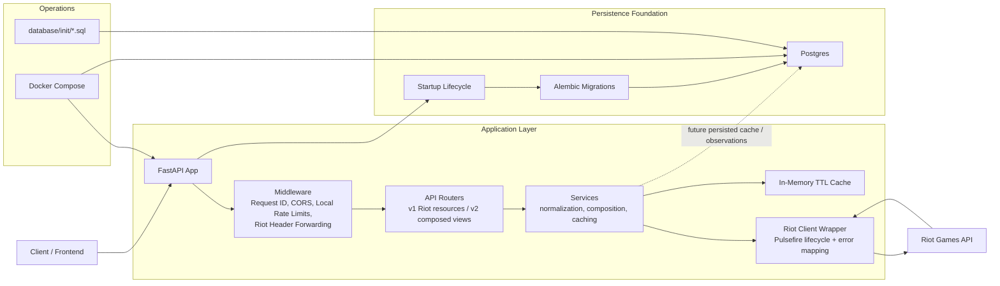

# Architecture

## Boundaries

- `app/api/routes` owns HTTP shape and endpoint versioning.
- `app/services` owns Riot workflow composition, region normalization, and cache use.
- `app/clients/riot.py` owns Pulsefire calls, Riot failure translation, and upstream header capture.
- `app/core` owns cross-cutting concerns: config, errors, CORS, request IDs, local rate limiting, cache primitives, and region helpers.
- `app/db` owns optional database lifecycle, sessions, and migration startup.
- `migrations/versions` owns database schema history.
- `database/init` owns Postgres first-boot database setup only.

## Versioning

Use `v1` for normalized Riot resource endpoints. Use `v2` for composed/product endpoints that combine multiple Riot resources or reshape data substantially.

## Persistence Direction

The first database migration creates operational tables for future persisted cache entries and observed Riot rate-limit headers. The current runtime still uses in-memory cache and rate-limit state; moving those to Postgres or Redis can happen behind service interfaces without changing endpoint shapes.
